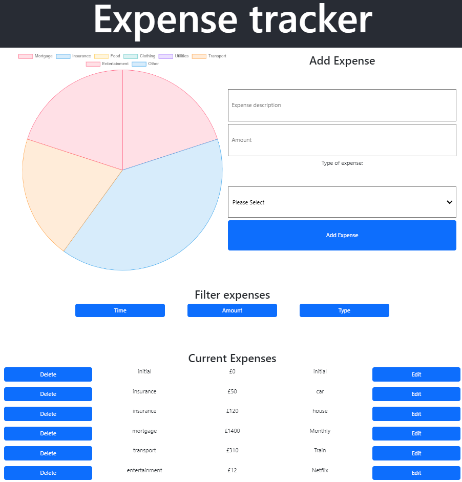
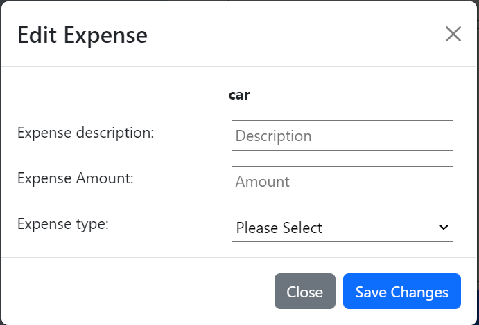
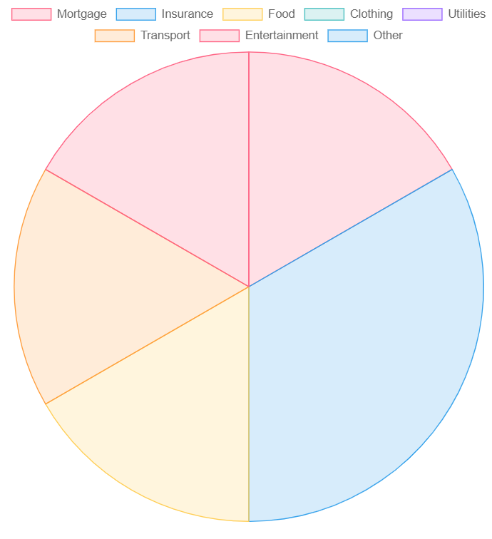

# Expense Tracker

The aim for this project to for a user to input expenses, catergories them with the dropdown provided, edit them and filter them in list view. There is a also a pie chat showing the allocation of each expense and how it relates as a whole. Jest and Cypress were used for testing
<br />


## Technologies
* React 18.2.0
* Bootstrap 5.2.0
* Chart.js 3.9.1
* Cypress 10.4.0
* Jest 28.1.3

<br />
<br />
## Installation
First, run the development server:

```bash
npm run dev
# or
yarn dev
```

Open [http://localhost:3000](http://localhost:3000) with your browser to see the result.

The page will reload when you make changes.\
You may also see any lint errors in the console.
<br />
<br />

## Usage

To add an expense you have 2 input boxes. one for the description and the second for the amount. After filling out the form select a category it falls into and then click the "Add expenses" button
<br />

<br />
<br />
The added expsense will show in the list view below
<br />

<br />
<br />
You can edit an expense by click the edit button in the list view. A modal will open. you can change the description, amount and the category. you can save your change or close the modal without saving. 
<br />

<br />
<br />
You can also filter the table by category type, Amount and Time. on fist click of one of the 3 filter buttons will filter the list in descending or and if you click it again will filter it to ascending order
<br />

<br />
<br />
Expenses that are added will be added to the chart
<br />



